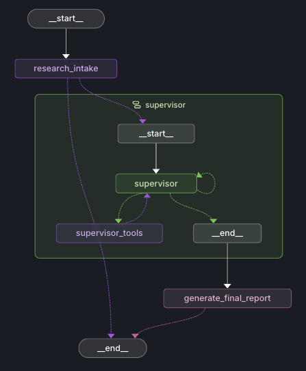

# Deep Research Agent

## 🔬 [Technical Design Document (docs/DESIGN.md)](docs/DESIGN.md)

A deep research agent implemented with [LangGraph](https://github.com/langchain-ai/langgraph), designed to accept a query and return a highly detailed, grounded report based on parallelized web research.

## Overview

This project implements a multi-step research workflow managed by a supervisor-worker architecture:

1. **Research Intake**: A conversational loop that refines your query and proposes a structured `ResearchBrief` (main topic, objective, and sub-topics).
2. **Research Loop**: A Supervisor intelligently breaks down the brief into a Todo list and spawns parallel Worker sub-agents. Workers use tools (like Exa Search) to gather information, automatically writing massive results to a Virtual File System (VFS) and synthesizing key findings into compressed summaries.
3. **Final Report Generation**: Aggregates all worker summaries and the original brief to generate a cohesive, deeply grounded report with in-text citations.

## Architecture

<p align="center">
  
</p>

## Getting Started

### Prerequisites

- [uv](https://github.com/astral-sh/uv) installed for fast Python package and environment management.
- Python 3.11+ (managed seamlessly via `uv`).

### Setup

1. **Clone the repository** and navigate into the directory.

2. **Initialize Environment**:
   Use `uv` to install dependencies and sync the environment:

   ```bash
   uv sync
   ```

3. **Configure Environment Variables**:
   Create a `.env` file in the root directory (based on `.env.example`):

   ```bash
   cp .env.example .env
   ```

   You must add the following required API keys to your `.env` file:
   - `OPENAI_API_KEY`: Required for the LLM backend (Supervisor, Workers, and Report Generation).
   - `EXA_API_KEY`: Required for the neural search tool used by the workers to gather information.

   *Refer to `.env.example` for advanced tuning parameters including model selection, research iteration limits, and search constraints.*

   *Optional:*
   - `LANGSMITH_API_KEY`: For tracing and visualization in LangGraph Studio (highly recommended).

4. **Launch Agent Server**:
   Run the development server to use LangGraph Studio or interact with the local API. We use `uvx` to ensure the correct environment and version:

   ```bash
   uvx --refresh --from "langgraph-cli[inmem]" --with-editable . --python 3.11 langgraph dev --allow-blocking
   ```

   Wait for the server to initialize. This will provide you with a local API URL and—most importantly—a link to the **LangGraph Studio UI**.

   ```text
   - 🚀 API: http://127.0.0.1:2024
   - 🎨 Studio UI: https://smith.langchain.com/studio/?baseUrl=http://127.0.0.1:2024
   ```

   *Note: You must have `LANGSMITH_API_KEY` configured in your `.env` to use the Studio UI for local debugging.*

## Project Structure

- `src/deep_research/graph.py`: Core LangGraph implementation linking the intake, supervisor, and worker nodes.
- `src/deep_research/state.py`: TypedDict and Pydantic schema definitions for the graph states.
- `src/deep_research/tools.py`: Custom defined tools (e.g., Exa search, restricted VFS file writers).
- `docs/ASSIGNMENT.md`: Original project requirements.
- `docs/DESIGN.md`: Detailed engineering process and architectural design decisions.

## Example Reports

You can view examples of high-quality reports generated by this agent in the `docs/example_output` directory:

- [Computational Biology Report](docs/example_output/final_report_2.md): "I want to learn about the new AI models that are being used in AI+computational biology. Specifically what models are being used with raw sequence (DNA/RNA/proteins/etc). How have this changed over the past 6 years."
- [Spatial Reasoning Report](docs/example_output/final_report_1.md): "Can world models reason over spatial data?"

## Development

- Use `uv add <package>` to install new dependencies (do not use pip directly).
- The project adheres to strict PEP 8 formatting. Use `uv run ruff check .` and `uv run ruff format .` to maintain code quality.
